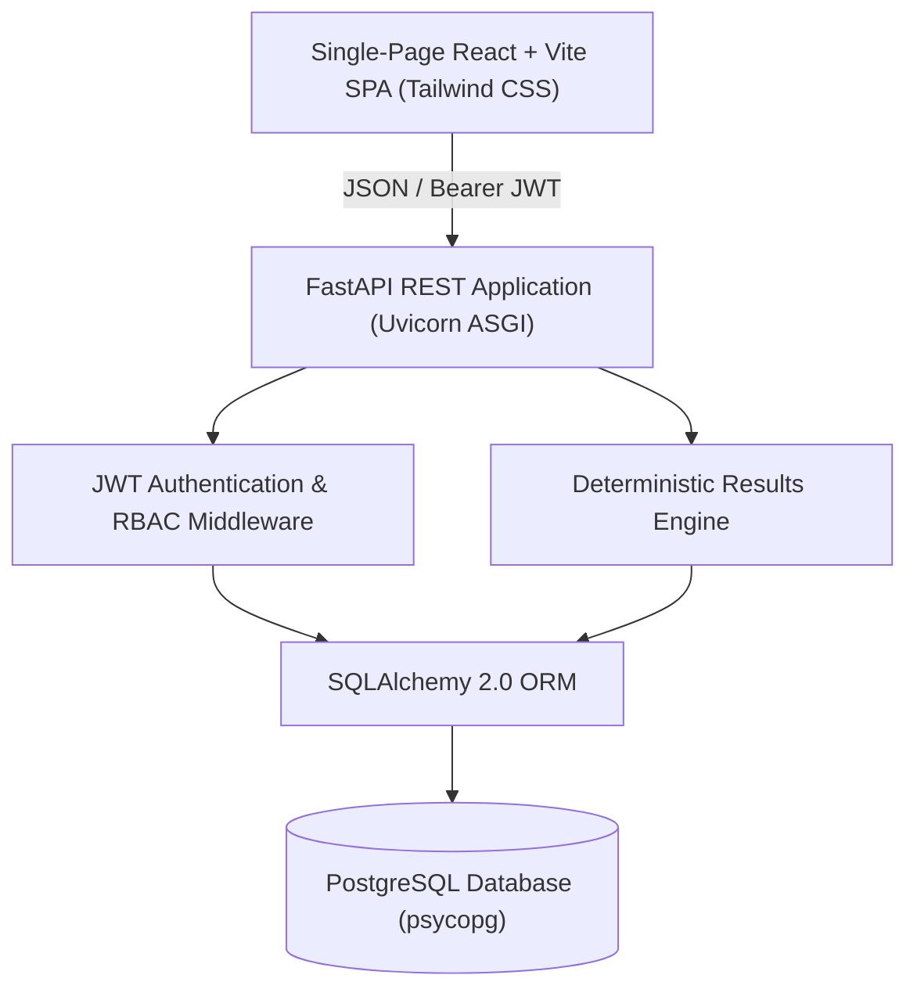
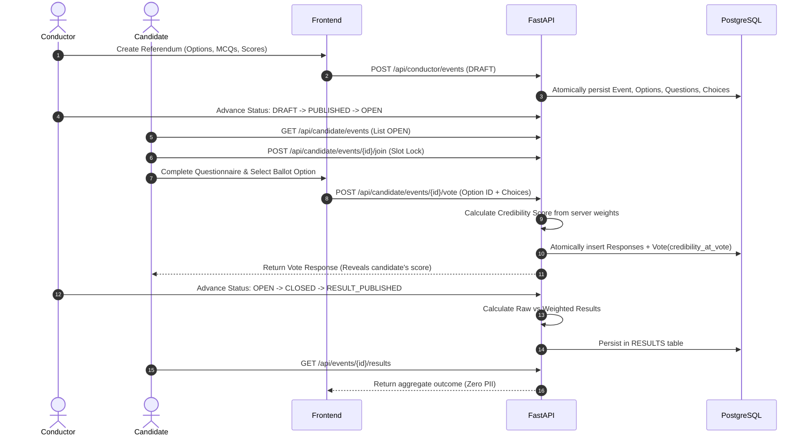

# TRUTH vs NOISE

> **"From popular opinion to credibility-weighted decisions."**

TRUTH vs NOISE is an academic decision-integrity platform designed to address the systemic vulnerabilities of simple majority voting in domain-specific referendums. By pairing voting options with context-specific, server-evaluated credibility assessments, the system deterministically computes two distinct outcomes: a **Raw Community Result** (reflecting popular vote count) and a **Credibility-Weighted Result** (weighting each ballot by the voter's demonstrated domain knowledge).

---

## Table of Contents

1. [Problem Statement](#problem-statement)
2. [Proposed Solution](#proposed-solution)
3. [Objectives](#objectives)
4. [Key Features](#key-features)
5. [System Architecture](#system-architecture)
6. [Technology Stack](#technology-stack)
7. [User Roles](#user-roles)
8. [End-to-End Workflow](#end-to-end-workflow)
9. [Credibility-Weighted Voting Concept](#credibility-weighted-voting-concept)
10. [Raw vs Weighted Result Calculation](#raw-vs-weighted-result-calculation)
11. [Signature Demonstration Scenario](#signature-demonstration-scenario)
12. [Security & Privacy Architecture](#security--privacy-architecture)
13. [Database & Models Overview](#database--models-overview)
14. [API Specification Summary](#api-specification-summary)
15. [Frontend Architecture](#frontend-architecture)
16. [Installation & Setup](#installation--setup)
17. [Running the Application](#running-the-application)
18. [Testing & Verification](#testing--verification)
19. [Project Limitations](#project-limitations)
20. [Future Enhancements](#future-enhancements)
21. [Documentation Index](#documentation-index)

---

## Problem Statement

Traditional digital voting and polling systems treat all cast ballots with equal weight. In high-stakes or technically complex environments (such as academic policy reform, energy grid transitions, clinical protocols, or technical standards), pure majority voting is susceptible to:
- **Popularity and Volume Bias**: Large volumes of uninformed or superficial voters overpowering domain-informed consensus.
- **Coordination Attacks**: Misinformation campaigns driving vote surges without underlying subject understanding.
- **Lack of Transparency**: Binary outcomes without comparative insights into how informed participants voted relative to the general population.

---

## Proposed Solution

**TRUTH vs NOISE** decouples popular opinion from credibility consensus without disenfranchising any participant. Every candidate casts exactly one ballot and completes an event-specific multiple-choice credibility questionnaire. The server computes each voter's credibility weight in absolute secrecy before committing the vote atomically.

When the referendum concludes, the platform publishes:
1. **Raw Community Majority**: The unweighted popular vote tally.
2. **Credibility-Weighted Consensus**: The outcome weighted by participant assessment scores.
3. **Core Divergence Analysis**: Clear visual and numerical contrast demonstrating when popular volume diverges from credibility-weighted consensus.

---

## Objectives

- **Deterministic Evaluation**: Pure mathematical calculation of credibility scores and outcomes with zero random tiebreakers.
- **Strict Score Secrecy**: Concealing choice scores and question weights from voters to prevent reverse-engineering of optimal answers.
- **Atomicity & Immutability**: Committing assessment responses and votes in single ACID transactions with historical credibility snapshots.
- **Voter Privacy**: Aggregating all published results with zero Personally Identifiable Information (PII), voter emails, or private responses exposed.
- **Role Isolation**: Strict boundaries between conductors (hosts) and candidates (voters).

---

## Key Features

- **Dynamic Referendum Builder**: Conductors define ballot options, question prompts, choices, and non-negative score weights.
- **Deterministic Lifecycle Engine**: State machine strictly enforcing `DRAFT -> PUBLISHED -> OPEN -> CLOSED -> RESULT_PUBLISHED`.
- **Atomic Slot Reservation**: Concurrency-safe capacity management using PostgreSQL row locking (`SELECT FOR UPDATE`).
- **One-Vote Guarantee**: Double-voting prevention enforced at both application and database constraint levels (`UNIQUE(event_id, candidate_id)`).
- **Presentation-Ready Results Dashboard**: Dual progress meters, 4-decimal precision summary tables, and objective divergence callouts.

---

## System Architecture



---

## Technology Stack

### Backend
- **Framework**: FastAPI (Python 3.12)
- **ASGI Server**: Uvicorn
- **ORM**: SQLAlchemy 2.0
- **Database Driver**: psycopg
- **Database Engine**: PostgreSQL 16
- **Password Hashing**: bcrypt (passlib)
- **Token Format**: PyJWT (HMAC-SHA256)
- **Validation**: Pydantic v2

### Frontend
- **Framework**: React 19 SPA
- **Build Tool**: Vite 8
- **Styling**: Tailwind CSS
- **Routing**: React Router v7
- **HTTP Client**: Axios with centralized Bearer interceptors
- **Linter**: Oxlint

---

## User Roles

| Role | Description | Key Permissions |
|---|---|---|
| **CONDUCTOR** | Referendum host / administrator | Create referendums, configure scoring weights, advance lifecycle states, publish results. |
| **CANDIDATE** | Voter / community participant | Browse open events, join referendums, complete credibility assessment, cast vote, view results. |

---

## End-to-End Workflow



---

## Credibility-Weighted Voting Concept

Every credibility question $Q_i$ has a set of choices with conductor-defined scores $s_{ij} \ge 0$.
The maximum possible score for question $Q_i$ is:
$$S_{\max}(Q_i) = \max_{j} (s_{ij})$$

For a candidate selecting choice $c_i$ for each question:
$$S_{\text{earned}} = \sum_{i=1}^{n} \text{score}(c_i)$$
$$S_{\text{total\_max}} = \sum_{i=1}^{n} S_{\max}(Q_i)$$

The candidate's permanent credibility percentage is:
$$\text{Credibility Score \%} = \begin{cases} 100.0000\% & \text{if } S_{\text{total\_max}} = 0 \\ \operatorname{round}\left(\frac{S_{\text{earned}}}{S_{\text{total\_max}}} \times 100.0, 4\right) & \text{otherwise} \end{cases}$$

This percentage is written permanently to `votes.credibility_at_vote` at the exact instant the ballot is committed.

---

## Raw vs Weighted Result Calculation

### 1. Raw Community Result
For each option $k$:
$$\text{Raw Count}_k = \sum [ \text{vote.selected\_option\_id} = k ]$$
$$\text{Raw Share \%}_k = \begin{cases} 0.0000\% & \text{if } \text{Total Votes} = 0 \\ \operatorname{round}\left(\frac{\text{Raw Count}_k}{\text{Total Votes}} \times 100.0, 4\right) & \text{otherwise} \end{cases}$$

### 2. Credibility-Weighted Result
For each option $k$:
$$\text{Weighted Sum}_k = \sum_{v \in \text{Votes}_k} v.\text{credibility\_at\_vote}$$
$$\text{Weighted Share \%}_k = \begin{cases} 0.0000\% & \text{if } \text{Total Weight} = 0 \\ \operatorname{round}\left(\frac{\text{Weighted Sum}_k}{\text{Total Weight}} \times 100.0, 4\right) & \text{otherwise} \end{cases}$$

### 3. Decision Status
- `DECIDED`: Unique option with highest `Weighted Sum`.
- `TIE`: Top multiple options share exact identical `Weighted Sum`.
- `NO_VOTES`: Zero ballots cast.
- `NO_WEIGHT`: Ballots cast with total credibility weight of 0.

---

## Signature Demonstration Scenario

The system's core value proposition is showcased in the verified 10-voter scenario:

| Voter Group | Count | Ballot Option | Individual Weights | Total Group Weight |
|---|---|---|---|---|
| Domain Informed | 4 | **YES** | 95.0, 90.0, 85.0, 80.0 | **350.0000** |
| General Volume | 6 | **NO** | 40.0, 35.0, 30.0, 25.0, 20.0, 15.0 | **165.0000** |
| Abstain / Neutral | 0 | **NEUTRAL** | - | **0.0000** |
| **Total** | **10** | - | - | **515.0000** |

### Verified Outcome

```
--- RAW COMMUNITY MAJORITY ---
YES: 4 votes (40.0000%)
NO:  6 votes (60.0000%)  --> RAW WINNER: NO

--- CREDIBILITY-WEIGHTED CONSENSUS ---
YES: 350.0000 weight (67.9612%)  --> FINAL PLATFORM WINNER: YES
NO:  165.0000 weight (32.0388%)
NEUTRAL: 0.0000 weight (0.0000%)

CORE DIVERGENCE:
Raw community voting favored NO (60.0%), while credibility-weighted voting selected YES (67.9612%).
```

---

## Security & Privacy Architecture

1. **Score Secrecy**: Candidate schemas omit numerical score attributes.
2. **ACID Transaction Atomicity**: Assessment answers and vote row committed together or rolled back.
3. **Database Unique Constraints**: `UNIQUE(event_id, candidate_id)` on `event_participants` and `votes`.
4. **Concurrency Protection**: PostgreSQL `SELECT ... FOR UPDATE` prevents exceeding `max_voters`.
5. **Zero-PII Results**: Endpoints expose strictly aggregate metrics (`total_votes`, `total_weight`, options).
6. **Idempotent Results**: `UNIQUE(event_id)` on `RESULTS` table prevents duplicate calculations.

---

## Installation & Setup

### Prerequisites
- Python 3.12+
- Node.js 18+ and npm
- PostgreSQL 14+ running locally

### 1. Database Setup
```sql
CREATE DATABASE truth_vs_noise;
```

### 2. Backend Installation
```bash
cd backend
python -m venv venv
venv\Scripts\activate      # Windows
# source venv/bin/activate # Linux/macOS
pip install -r requirements.txt
alembic upgrade head
```

### 3. Frontend Installation
```bash
cd ../frontend
npm install
```

---

## Running the Application

### Start Backend
```bash
cd backend
venv\Scripts\activate
uvicorn app.main:app --reload --host 127.0.0.1 --port 8000
```
- Swagger API Docs: `http://127.0.0.1:8000/docs`

### Start Frontend
```bash
cd frontend
npm run dev
```
- Web Application: `http://localhost:5173`

---

## Testing & Verification

### Run Frontend Linter & Build
```bash
cd frontend
npm run lint
npm run build
```

### Run Master Integration Test Suite
```bash
cd backend
venv\Scripts\python "..\..\..\..\..\Users\admin\.gemini\antigravity-ide\brain\25404823-0656-477c-a0f6-8727db52a14f\scratch\test_step14_full_integration.py"
```

---

## Project Limitations

- **Questionnaire-Dependent Credibility**: Credibility scores reflect responses to configured questions; the system does not independently authenticate external identity or background.
- **Deterministic Scope**: The platform relies on structured scoring rules without autonomous external validation.
- **Conductor Responsibility**: Fairness of the outcome depends on the conductor's balanced question and score weight configuration.

---

## Documentation Index

Explore the comprehensive academic and engineering documentation in the [`docs/`](./docs/README.md) directory:

- [System Architecture](./docs/diagrams/system-architecture.md)
- [Use Case Diagram](./docs/diagrams/use-case.md)
- [Entity Relationship (ER) Diagram](./docs/diagrams/er-diagram.md)
- [Class Diagram](./docs/diagrams/class-diagram.md)
- [Candidate Voting Sequence](./docs/diagrams/sequence-voting.md)
- [Result Publication Sequence](./docs/diagrams/sequence-results.md)
- [Voting Activity Diagram](./docs/diagrams/activity-voting.md)
- [Event Lifecycle State Machine](./docs/diagrams/event-lifecycle.md)
- [Data Flow Diagrams (Level 0 & 1)](./docs/diagrams/dfd-level-0.md)
- [Credibility Calculation Specification](./docs/credibility-calculation.md)
- [Results Engine Specification](./docs/results-calculation.md)
- [Security & Privacy Architecture](./docs/security.md)
- [REST API Reference](./docs/api.md)
- [Database Schema Specification](./docs/database.md)
- [Verification & Testing Report](./docs/testing.md)
- [Demonstration Scenario Analysis](./docs/demo-scenario.md)
- [Project Limitations](./docs/limitations.md)
- [Future Enhancements Roadmap](./docs/future-enhancements.md)
