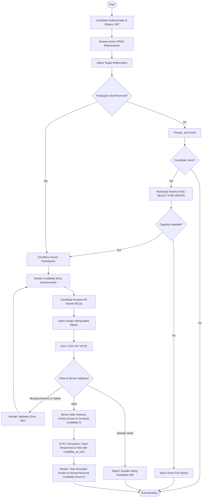

# Candidate Voting Activity Diagram

The Activity Diagram models the step-by-step workflow of a candidate participating in an active voting event on the **TRUTH vs NOISE** platform.

---

## Activity Diagram

---

## Key Decision Points

1. **Slot Capacity Check**: Prior to entering the voting phase, the server verifies available voter slots under row-level locking (`SELECT FOR UPDATE`).
2. **Completeness Validation**: The server rejects any ballot submission where one or more assessment questions lack a valid selected choice.
3. **Single Vote Enforcement**: Once a vote is committed to the `votes` table, subsequent submission attempts are intercepted with `400 Bad Request`.
