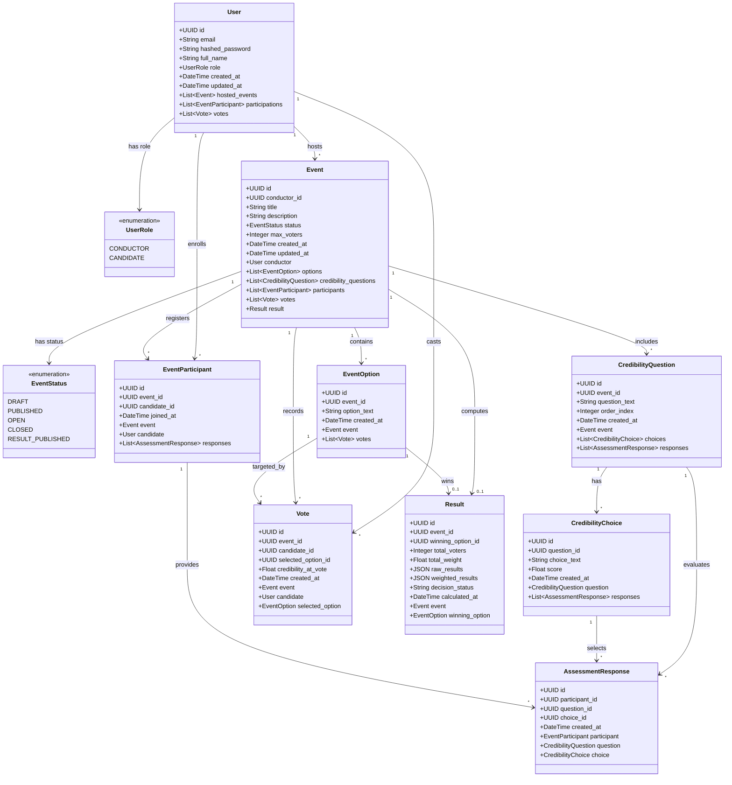

# Class Diagram

The Class Diagram represents the domain model entities and relationships implemented in the SQLAlchemy 2.0 ORM tier (`backend/app/models/`).

---

## Domain Model Class Diagram

```mermaid
classDiagram
    class UserRole {
        <<enumeration>>
        CONDUCTOR
        CANDIDATE
    }

    class EventStatus {
        <<enumeration>>
        DRAFT
        PUBLISHED
        OPEN
        CLOSED
        RESULT_PUBLISHED
    }

    class User {
        +UUID id
        +String email
        +String hashed_password
        +String full_name
        +UserRole role
        +DateTime created_at
        +DateTime updated_at
        +List~Event~ hosted_events
        +List~EventParticipant~ participations
        +List~Vote~ votes
    }

    class Event {
        +UUID id
        +UUID conductor_id
        +String title
        +String description
        +EventStatus status
        +Integer max_voters
        +DateTime created_at
        +DateTime updated_at
        +User conductor
        +List~EventOption~ options
        +List~CredibilityQuestion~ credibility_questions
        +List~EventParticipant~ participants
        +List~Vote~ votes
        +Result result
    }

    class EventOption {
        +UUID id
        +UUID event_id
        +String option_text
        +DateTime created_at
        +Event event
        +List~Vote~ votes
    }

    class CredibilityQuestion {
        +UUID id
        +UUID event_id
        +String question_text
        +Integer order_index
        +DateTime created_at
        +Event event
        +List~CredibilityChoice~ choices
        +List~AssessmentResponse~ responses
    }

    class CredibilityChoice {
        +UUID id
        +UUID question_id
        +String choice_text
        +Float score
        +DateTime created_at
        +CredibilityQuestion question
        +List~AssessmentResponse~ responses
    }

    class EventParticipant {
        +UUID id
        +UUID event_id
        +UUID candidate_id
        +DateTime joined_at
        +Event event
        +User candidate
        +List~AssessmentResponse~ responses
    }

    class AssessmentResponse {
        +UUID id
        +UUID participant_id
        +UUID question_id
        +UUID choice_id
        +DateTime created_at
        +EventParticipant participant
        +CredibilityQuestion question
        +CredibilityChoice choice
    }

    class Vote {
        +UUID id
        +UUID event_id
        +UUID candidate_id
        +UUID selected_option_id
        +Float credibility_at_vote
        +DateTime created_at
        +Event event
        +User candidate
        +EventOption selected_option
    }

    class Result {
        +UUID id
        +UUID event_id
        +UUID winning_option_id
        +Integer total_voters
        +Float total_weight
        +JSON raw_results
        +JSON weighted_results
        +String decision_status
        +DateTime calculated_at
        +Event event
        +EventOption winning_option
    }

    User "1" --> "*" Event : hosts
    User "1" --> "*" EventParticipant : enrolls
    User "1" --> "*" Vote : casts
    User --> UserRole : has role

    Event "1" --> "*" EventOption : contains
    Event "1" --> "*" CredibilityQuestion : includes
    Event "1" --> "*" EventParticipant : registers
    Event "1" --> "*" Vote : records
    Event "1" --> "0..1" Result : computes
    Event --> EventStatus : has status

    CredibilityQuestion "1" --> "*" CredibilityChoice : has
    CredibilityQuestion "1" --> "*" AssessmentResponse : evaluates

    CredibilityChoice "1" --> "*" AssessmentResponse : selects

    EventParticipant "1" --> "*" AssessmentResponse : provides

    EventOption "1" --> "*" Vote : targeted_by
    EventOption "1" --> "0..1" Result : wins
```
