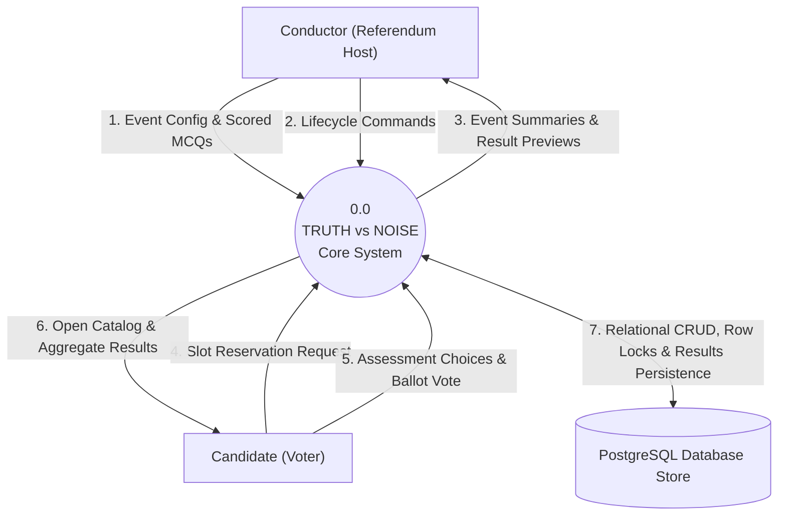

# Data Flow Diagram - Level 0 (Context Diagram)

The Level 0 Context Diagram establishes the boundary of the **TRUTH vs NOISE** system and its primary external entities: **Conductor**, **Candidate**, and the **PostgreSQL Relational Store**.

---

## DFD Level 0 Context Diagram

---

## Data Flows

1. **Event Config & Scored MCQs**: Referendum titles, capacities, options, and scored credibility questions sent by conductors.
2. **Lifecycle Commands**: Status updates (`DRAFT -> PUBLISHED -> OPEN -> CLOSED -> RESULT_PUBLISHED`).
3. **Event Summaries & Result Previews**: Managed event listings and closed result metrics returned to conductors.
4. **Slot Reservation Request**: Candidate join requests verified against max voter capacity.
5. **Assessment Choices & Ballot Vote**: Candidate MCQ choice selections and chosen ballot option.
6. **Open Catalog & Aggregate Results**: Public event listings and zero-PII final results.
7. **Relational Operations**: ACID transactions, row-level locks, and persisted calculations in PostgreSQL.
