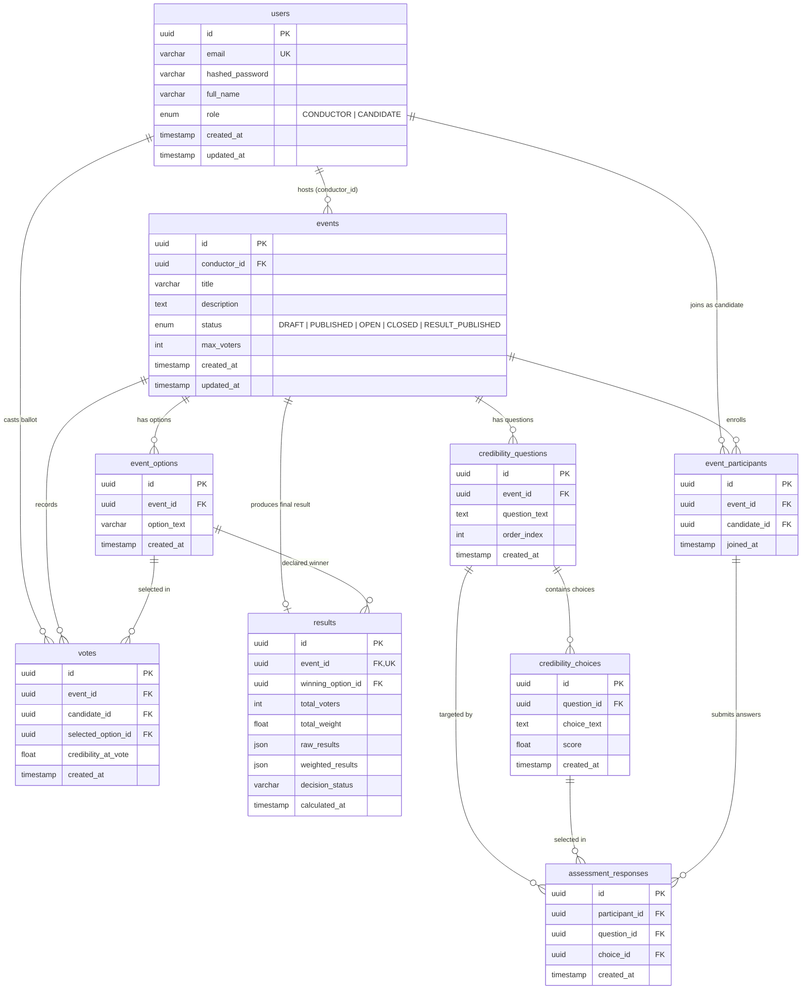

# Entity-Relationship (ER) Diagram

The ER diagram illustrates the relational data model implemented via SQLAlchemy 2.0 and persisted in PostgreSQL.

---

## Entity-Relationship Diagram

---

## Key Constraints & Relationships

1. **Unique Participant Per Event**: `UNIQUE(event_id, candidate_id)` on `event_participants` ensures a candidate can only join an event once.
2. **Single Vote Constraint**: `UNIQUE(event_id, candidate_id)` on `votes` enforces that each candidate can cast at most one ballot per referendum.
3. **Single Result Constraint**: `UNIQUE(event_id)` on `results` ensures results publication is strictly idempotent.
4. **Historical Credibility Snapshot**: `votes.credibility_at_vote` permanently stores the voter's calculated weight percentage at the time of voting, decoupling it from any subsequent MCQ edits.
