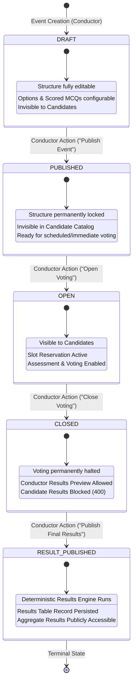

# Event Lifecycle State Machine

The **TRUTH vs NOISE** referendum lifecycle is governed by a strict, one-way deterministic finite state machine.

---

## Lifecycle State Diagram

---

## State Transition Rules

| From State | To State | Trigger / Action | Side Effects & Invariants |
|---|---|---|---|
| *(None)* | `DRAFT` | `POST /api/conductor/events` | Event created; conductor assigned. |
| `DRAFT` | `PUBLISHED` | `PATCH .../status` (`PUBLISHED`) | Options and questions locked; no further modifications permitted. |
| `PUBLISHED` | `OPEN` | `PATCH .../status` (`OPEN`) | Event published to candidate catalog; voting opens. |
| `OPEN` | `CLOSED` | `PATCH .../status` (`CLOSED`) | Voting concluded; no new votes permitted. |
| `CLOSED` | `RESULT_PUBLISHED` | `PATCH .../status` (`RESULT_PUBLISHED`) | `calculate_event_results()` executes; results persisted to `results` table. |

### Invalid Transitions
All other transitions (e.g., `DRAFT -> OPEN`, `OPEN -> DRAFT`, `RESULT_PUBLISHED -> CLOSED`) are strictly rejected by the backend validation layer with `400 Bad Request`.
