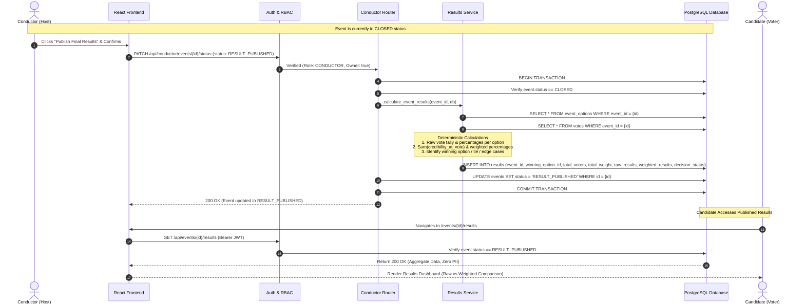

# Result Publication Sequence Diagram

This sequence diagram illustrates the lifecycle transition from `CLOSED` to `RESULT_PUBLISHED`, the deterministic execution of the results calculation engine, and the secure retrieval of zero-PII aggregate results.

---

## Sequence Diagram

---

## Results Privacy & Data Hygiene

- **Aggregate Only**: The `results` payload contains strictly summary numbers: `total_votes`, `total_weight`, `raw_results` (option text, count, percentage), and `weighted_results` (option text, weighted sum, percentage).
- **Zero Identity Leakage**: No candidate user IDs, participant enrollment timestamps, individual assessment responses, or personal credibility scores are returned in public result endpoints.
