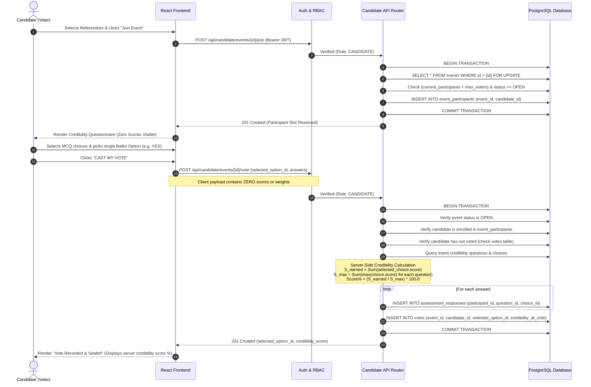

# Candidate Voting Sequence Diagram

This diagram demonstrates the end-to-end execution of candidate assessment, server-side credibility calculation, and atomic vote casting.

---

## Sequence Diagram

---

## Security & Integrity Points

1. **Client Score Ignorance**: The client payload consists exclusively of `selected_option_id` and a list of `{ question_id, selected_choice_id }`.
2. **Server-Side Scoring**: The calculation engine directly fetches `score` from the relational `credibility_choices` table on the server.
3. **Double-Voting Prevention**: Protected by both application validation and the database constraint `UNIQUE(event_id, candidate_id)` on the `votes` table.
4. **Immutable Snapshot**: The calculated percentage is stored permanently in `votes.credibility_at_vote`, insulating the ballot from any future MCQ edits.
