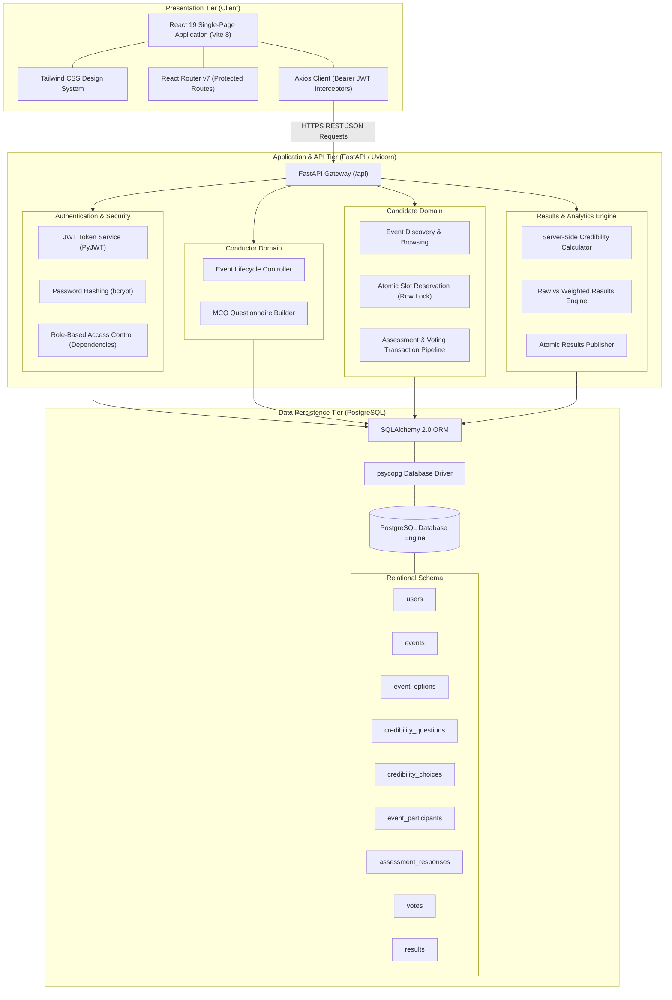

# System Architecture

The **TRUTH vs NOISE** platform is structured as a multi-tier, decoupled client-server architecture designed for deterministic credibility calculation, role separation, and voter privacy.

---

## High-Level Tier Architecture

---

## Architectural Principles

1. **Client Decoupling**: The React frontend acts strictly as a presentation and interaction layer. It never computes credibility percentages, weighted sums, or winner decisions.
2. **Server-Side Scoring Secrecy**: Numerical score weights configured by conductors are stored exclusively in `credibility_choices.score` and are never serialized to candidate endpoints.
3. **Transactional Integrity**: When a candidate votes, the insertion of `assessment_responses` and the `votes` record occurs in a single atomic database transaction with the calculated `credibility_at_vote` snapshot.
4. **Concurrency Safety**: Participant slot reservations utilize PostgreSQL `SELECT FOR UPDATE` row-level locks on the target event to prevent race conditions from violating `max_voters`.
