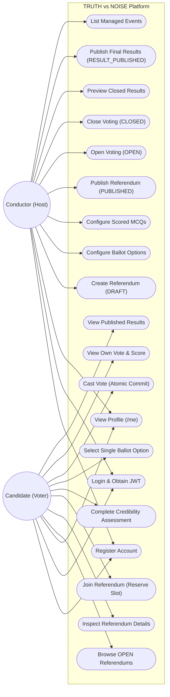

# Use Case Diagram

The **TRUTH vs NOISE** system defines two primary actors with distinct capabilities and security perimeters: **CONDUCTOR** (Referendum Administrator) and **CANDIDATE** (Voter).

---

## Actor & Use Case Model

---

## Use Case Descriptions

### 1. Conductor Use Cases
- **Create Referendum**: Initializes an event in `DRAFT` status with a title, description, and maximum voter capacity.
- **Configure Ballot Options**: Adds a minimum of 2 distinct voting options (e.g. YES, NO, NEUTRAL).
- **Configure Credibility Questions**: Creates multiple-choice questions with choices and non-negative score weights.
- **Lifecycle Management**: Advances the event through `DRAFT -> PUBLISHED -> OPEN -> CLOSED -> RESULT_PUBLISHED`.
- **Publish Final Results**: Calculates and commits the deterministic raw and credibility-weighted outcomes to the `RESULTS` table.

### 2. Candidate Use Cases
- **Browse OPEN Referendums**: Discovers currently active voting events with real-time slot capacity.
- **Join Referendum**: Atomically reserves a participation slot prior to voting.
- **Complete Credibility Assessment**: Answers all questionnaire multiple-choice prompts (scores remain hidden).
- **Cast Vote**: Submits ballot selection and answers in a single transaction, immediately revealing the server-calculated credibility score percentage.
- **View Published Results**: Accesses aggregate community and weighted outcomes once the event reaches `RESULT_PUBLISHED`.
