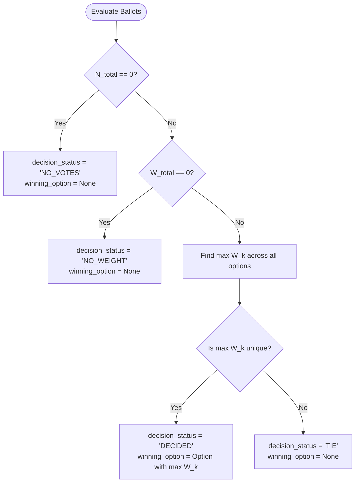

# Results Calculation Engine Specification

The Results Calculation Engine ([backend/app/services/results_service.py](file:///d:/Projects/truth%20vs%20noise/backend/app/services/results_service.py)) deterministically evaluates all cast ballots to compute both the **Raw Community Majority** and the **Credibility-Weighted Consensus**.

---

## Mathematical Formulation

Let an event possess $K$ options:
$$\mathcal{O} = \{ O_1, O_2, \dots, O_K \}$$

Let $\mathcal{V}$ represent the set of all cast ballots, where each ballot $v \in \mathcal{V}$ has:
- $v.\text{selected\_option\_id} \in \mathcal{O}$
- $v.\text{credibility\_at\_vote} \ge 0$

### 1. Total Metrics
- **Total Votes**:
  $$N_{\text{total}} = |\mathcal{V}|$$
- **Total Credibility Weight**:
  $$W_{\text{total}} = \sum_{v \in \mathcal{V}} v.\text{credibility\_at\_vote}$$

### 2. Option-Level Metrics
For each option $O_k$:
- **Option Ballots**:
  $$\mathcal{V}_k = \{ v \in \mathcal{V} \mid v.\text{selected\_option\_id} = O_k \}$$
- **Raw Vote Count**:
  $$C_k = |\mathcal{V}_k|$$
- **Raw Vote Share %**:
  $$P_k^{\text{raw}} = \begin{cases} 
  0.0000\% & \text{if } N_{\text{total}} = 0 \\
  \operatorname{round}\left( \frac{C_k}{N_{\text{total}}} \times 100.0, 4 \right) & \text{if } N_{\text{total}} > 0 
  \end{cases}$$
- **Weighted Score Sum**:
  $$W_k = \sum_{v \in \mathcal{V}_k} v.\text{credibility\_at\_vote}$$
- **Weighted Vote Share %**:
  $$P_k^{\text{weighted}} = \begin{cases} 
  0.0000\% & \text{if } W_{\text{total}} = 0 \\
  \operatorname{round}\left( \frac{W_k}{W_{\text{total}}} \times 100.0, 4 \right) & \text{if } W_{\text{total}} > 0 
  \end{cases}$$

---

## Winner Determination & Decision Status

The engine evaluates outcomes through the following priority logic:

### Edge Case Handling
1. **Zero-Vote Options**: Included in both `raw_results` and `weighted_results` lists with count $0$, sum $0.0000$, and share $0.0000\%$.
2. **Raw Ties vs Weighted Ties**: Raw ties and weighted ties are independently tracked. A tie in the raw tally does not inhibit a decisive weighted consensus.
3. **Database Idempotency**: Results are written to the `results` table via an atomic upsert on `UNIQUE(event_id)`.
