# Security & Privacy Architecture

The **TRUTH vs NOISE** platform enforces defense-in-depth security across authentication, authorization, concurrency control, data integrity, and voter privacy.

---

## 1. Authentication & Identity

- **Password Hashing**: User passwords are encrypted using `bcrypt` (via `passlib`) with automatic salt generation. Raw passwords are never persisted or logged.
- **Stateless Session Tokens**: Authenticated requests issue signed `JSON Web Tokens (JWT)` using `HMAC-SHA256 (HS256)`. Tokens encode the user's `sub` (User UUID), `role`, and expiration timestamp (`exp`).
- **Token Interception**: The frontend Axios client automatically injects the Bearer token into HTTP `Authorization` headers and clears invalid credentials on `401 Unauthorized`.

---

## 2. Role-Based Access Control (RBAC)

FastAPI dependency injection guarantees role boundaries at the controller level:

| Router Path | Required Role | Failure Response |
|---|---|---|
| `/api/conductor/*` | `CONDUCTOR` | `403 Forbidden` |
| `/api/candidate/*` | `CANDIDATE` | `403 Forbidden` |
| `/api/auth/me` | Authenticated | `401 Unauthorized` |
| `/api/events/{id}/results` | Authenticated / Allowed State | `400 / 401 / 403` |

### Conductor Ownership Enforcement
All mutations or queries to specific events (`/api/conductor/events/{id}*`) verify that `event.conductor_id == current_user.id`, preventing conductors from inspecting or altering other conductors' referendums.

---

## 3. Score Secrecy Perimeter

```mermaid
graph LR
    subgraph CandidateBoundary["Candidate Security Boundary"]
        CandidateUI["Candidate Interface"]
        CandidateSchema["Candidate Pydantic Schema"]
    end

    subgraph ServerPerimeter["Server Security Perimeter"]
        DBStore[("credibility_choices.score")]
        CalcService["Calculation Engine"]
    end

    CandidateUI -.->|Choice IDs Only| CandidateSchema
    CandidateSchema --> CalcService
    DBStore -->|Fetch Secret Scores| CalcService
    CalcService -->|Snapshot credibility_at_vote| DBStore

    style CandidateBoundary fill:#1e293b,stroke:#ef4444,stroke-width:2px
    style ServerPerimeter fill:#0f172a,stroke:#10b981,stroke-width:2px
```

- **Schema Exclusion**: The Pydantic candidate schema ([backend/app/schemas/candidate.py](file:///d:/Projects/truth%20vs%20noise/backend/app/schemas/candidate.py)) completely omits `score` from all question choices.
- **Client Payload**: The candidate payload sends only `{ question_id, selected_choice_id }` without scores or weights.

---

## 4. Concurrency & Integrity Controls

1. **Row-Level Slot Reservation**: Participant capacity enforcement uses PostgreSQL `SELECT ... FOR UPDATE` locking to prevent race conditions from exceeding `max_voters`.
2. **Duplicate Join Prevention**: Protected by the database constraint `UNIQUE(event_id, candidate_id)` on `event_participants`.
3. **Single Vote Guarantee**: Double-voting is strictly barred by `UNIQUE(event_id, candidate_id)` on `votes`.
4. **ACID Transaction Atomicity**: Assessment responses and ballot records are committed within a single database transaction block. If an error occurs, the entire transaction rolls back cleanly.
5. **Results Publication Idempotency**: Protected by `UNIQUE(event_id)` on the `results` table.

---

## 5. Voter Privacy & Zero-PII Policy

- **No Individual Vote Publication**: The platform exposes strictly aggregate counts, sums, and percentages.
- **Zero Identification**: Results payloads contain no voter names, candidate IDs, timestamps, or individual questionnaire answers.
- **Restricted Result Access**: Candidates are barred from viewing results during `OPEN` and `CLOSED` states until the conductor publishes final results (`RESULT_PUBLISHED`).
